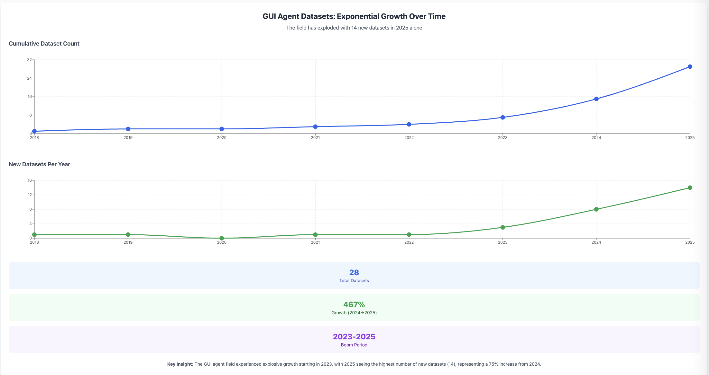

# Awesome GUI Agent Datasets for Computer and Phone Use

This curated list features top datasets for training GUI agents—AI systems that automate interactions with graphical user interfaces (GUIs) on computers, phones, and browsers. Ideal for researchers and developers, these datasets support tasks like clicking, typing, and navigating visual elements. Sorted by year (most recent first), each entry includes a name, short description, and URL. Perfect for advancing AI agent training, GUI automation, and computer interaction research.

---

## 2025 Datasets

- **LearnGUI**  
  - *Description*: A dataset for studying illustration-based learning in mobile GUI agents, enhancing performance in unseen scenarios.  
  - *URL*: [https://huggingface.co/datasets/lgy0404/LearnGUI](https://huggingface.co/datasets/lgy0404/LearnGUI)

- **AndroidInteraction**  
  - *Description*: Focuses on user interaction needs and notifications in phone UI automation, enabling agent-initiated interactions.  
  - *URL*: [https://arxiv.org/abs/2503.19537](https://arxiv.org/abs/2503.19537)

- **WorldGUI**  
  - *Description*: An interactive benchmark for desktop GUI automation, supporting tasks across multiple applications from any starting point.  
  - *URL*: [https://github.com/showlab/WorldGUI](https://github.com/showlab/WorldGUI)

- **DeskVision**  
  - *Description*: Large-scale desktop region captioning dataset for advanced GUI agents, improving visual element understanding.  
  - *URL*: [https://arxiv.org/abs/2503.11170](https://arxiv.org/abs/2503.11170)

- **GUI-World**  
  - *Description*: Comprehensive GUI dataset with over 12K videos and 100K queries for evaluating multimodal LLM-based agents.  
  - *URL*: [https://gui-world.github.io/](https://gui-world.github.io/)

- **GUI-Lasagne**  
  - *Description*: Multi-level, large-scale dataset for training agents like SpiritSight, focusing on GUI understanding and grounding.  
  - *URL*: [https://arxiv.org/abs/2503.03196](https://arxiv.org/abs/2503.03196)

- **AgentStudio (GroundUI)**  
  - *Description*: Includes 18,000 instruction-screenshot pairs for evaluating GUI interactions in a versatile toolkit.  
  - *URL*: [https://github.com/agenticevangelist/agent-studio](https://github.com/agenticevangelist/agent-studio)

- **AgentStudio (IDMBench)**  
  - *Description*: Dataset for evaluating multi-step agent trajectories in GUI interactions.  
  - *URL*: [https://github.com/agenticevangelist/agent-studio](https://github.com/agenticevangelist/agent-studio)

- **AgentStudio (CriticBench)**  
  - *Description*: Dataset for assessing LLM-based agents’ reasoning and critique capabilities in GUI contexts.  
  - *URL*: [https://github.com/agenticevangelist/agent-studio](https://github.com/agenticevangelist/agent-studio)

- **GUICourse (GUIEnv)**  
  - *Description*: Features 10M page-caption pairs for training vision-based GUI agents across web and mobile.  
  - *URL*: [https://github.com/yiye3/GUICourse](https://github.com/yiye3/GUICourse)

- **GUICourse (GUIAct)**  
  - *Description*: Contains 67K single-step and 15K multi-step instructions for GUI actions.  
  - *URL*: [https://github.com/yiye3/GUICourse](https://github.com/yiye3/GUICourse)

- **GUICourse (GUIChat)**  
  - *Description*: Offers 44K single-turn QAs and 6K multi-turn dialogues for GUI interactions.  
  - *URL*: [https://github.com/yiye3/GUICourse](https://github.com/yiye3/GUICourse)

- **ScreenSpot-Pro**  
  - *Description*: Benchmark for GUI grounding in high-resolution professional environments, ideal for multimodal LLMs.  
  - *URL*: [https://huggingface.co/datasets/Voxel51/ScreenSpot-Pro](https://huggingface.co/datasets/Voxel51/ScreenSpot-Pro)

- **UEyes**  
  - *Description*: Eye-tracking dataset for understanding visual saliency across various user interfaces.  
  - *URL*: [https://github.com/YueJiang-nj/UEyes-CHI2023](https://github.com/YueJiang-nj/UEyes-CHI2023)

---

## 2024 Datasets

- **DroidCall**  
  - *Description*: Dataset for training LLMs to invoke Android intents accurately, boosting mobile agent capabilities.  
  - *URL*: [https://github.com/UbiquitousLearning/DroidCall](https://github.com/UbiquitousLearning/DroidCall)

- **MobileViews**  
  - *Description*: Large-scale mobile GUI dataset with over 600,000 screenshot-view hierarchy pairs from 20,000+ Android apps.  
  - *URL*: [https://huggingface.co/datasets/mllmTeam/MobileViews](https://huggingface.co/datasets/mllmTeam/MobileViews)

- **AMEX (Android Multi-annotation EXpo)**  
  - *Description*: Over 104,000 high-resolution screenshots from 110 popular mobile apps with detailed annotations.  
  - *URL*: [https://huggingface.co/datasets/Yuxiang007/AMEX](https://huggingface.co/datasets/Yuxiang007/AMEX)

- **AndroidControl**  
  - *Description*: 15,283 demonstrations of daily tasks across 833 Android apps, exploring data scale effects.  
  - *URL*: [https://huggingface.co/datasets/HarrytheOrange/parsed_AndroidControl](https://huggingface.co/datasets/HarrytheOrange/parsed_AndroidControl)

- **B-MoCA**  
  - *Description*: Benchmark for evaluating mobile control agents across diverse device configurations.  
  - *URL*: [https://github.com/gimme1dollar/b-moca](https://github.com/gimme1dollar/b-moca)

- **MobileAgentBench**  
  - *Description*: User-friendly benchmark with 100 tasks across 10 open-source apps for testing mobile LLM agents.  
  - *URL*: [https://MobileAgentBench.github.io](https://MobileAgentBench.github.io)

- **OmniACT**  
  - *Description*: Dataset for multimodal generalist agents performing tasks on desktop and web interfaces.  
  - *URL*: [https://arxiv.org/abs/2402.17553](https://arxiv.org/abs/2402.17553)

- **TongUI / GUI-Net**  
  - *Description*: Builds generalized GUI agents by learning from multimodal web tutorials across multiple OS.  
  - *URL*: [https://tongui-agent.github.io/](https://tongui-agent.github.io/)

- **CRAB**  
  - *Description*: Cross-environment benchmark for multimodal agents, supporting Ubuntu and Android tasks.  
  - *URL*: [https://crab.camel-ai.org/](https://crab.camel-ai.org/)

---

## 2023 Datasets

- **Android in the Wild (AITW)**  
  - *Description*: Large-scale dataset with 715,142 episodes for Android device control across 30,378 unique instructions.  
  - *URL*: [https://github.com/google-research/google-research/tree/master/android_in_the_wild](https://github.com/google-research/google-research/tree/master/android_in_the_wild)

- **AutoUI**  
  - *Description*: Leverages AITW to evaluate Auto-GUI, an LLM-based task automation system for Android.  
  - *URL*: [https://github.com/cooelf/Auto-GUI](https://github.com/cooelf/Auto-GUI)

- **WebShop**  
  - *Description*: Dataset for training autonomous agents in online shopping with 1.18 million real-world products.  
  - *URL*: [https://webshop-pnlp.github.io](https://webshop-pnlp.github.io)

---

## 2022 Datasets

- **META-GUI**  
  - *Description*: Benchmark for GUI-based task-oriented dialogue systems with 1,125 dialogues across six domains.  
  - *URL*: [https://x-lance.github.io/META-GUI-Leaderboard/](https://x-lance.github.io/META-GUI-Leaderboard/)

---

## 2021 Datasets

- **Screen2Words**  
  - *Description*: Dataset for generating concise language descriptions of mobile screens, with 112,085 summaries.  
  - *URL*: [https://github.com/google-research-datasets/screen2words](https://github.com/google-research-datasets/screen2words)

---

## 2020 and Earlier

- **RICO**  
  - *Description*: Contains 72,000 unique Android app UIs, a foundational dataset for mobile GUI research (circa 2018).  
  - *URL*: [https://www.kaggle.com/datasets/onurgunes1993/rico-dataset](https://www.kaggle.com/datasets/onurgunes1993/rico-dataset)

- **PixelHelp**  
  - *Description*: Features 187 multi-step instructions for common tasks on Google Pixel phones (circa 2019).  
  - *URL*: [https://paperswithcode.com/dataset/pixelhelp](https://paperswithcode.com/dataset/pixelhelp)

---

This Awesome List is a go-to resource for GUI agent datasets, covering training data for AI agents across mobile, desktop, and web environments. Contributions are welcome to keep it up-to-date with the latest advancements in computer interaction datasets!
